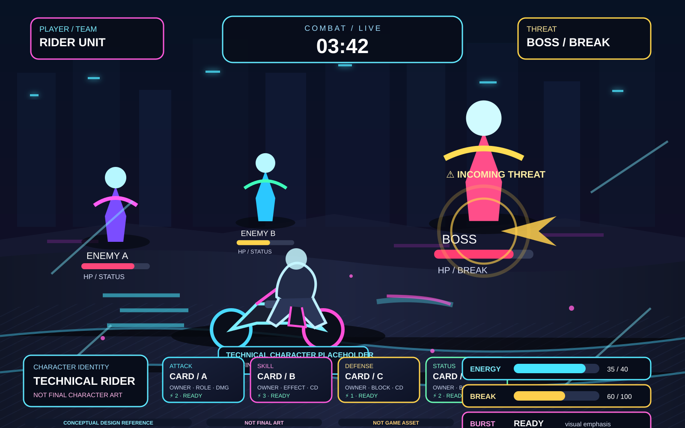

# Mach-Girls — Authoritative 2.5D Combat Visual Reference

Status: **PROPOSED VISUAL REFERENCE / DESIGN CONTRACT**  
Human approval: **PENDING**  
Final character art: **NOT APPROVED / NOT IMPLIED**  
Runtime change in Phase 26: **NO**

## Purpose

This document is the authoritative visual contract for the Mach-Girls combat scene.

Its primary purpose is to prevent future implementation sessions from collapsing the experience into:

```text
two sprites + cards
```

The intended experience is a complete 2.5D combat stage with battlefield depth, character/motorcycle presence, enemies, tactical threats, combat timing, resource hierarchy, cards, impact feedback, camera motion, particles, lighting and parallax.

This document governs **presentation architecture and visual hierarchy**. It does not redefine gameplay rules.

## Visual reference



**CONCEPTUAL DESIGN REFERENCE · NOT FINAL ART · NOT GAME ASSET**

The image is an authored SVG fallback reference created because the available AI image-generation services were unavailable for this session: the native image generator was rate-limited and Krea generation was blocked by insufficient account balance. The SVG is therefore a deliberate design reference, not an AI-approved art asset.

## Experience statement

Mach-Girls combat should read as:

```text
2.5D battlefield
+
character presence
+
motorcycle presence
+
enemy spatial presence
+
depth
+
combat timer
+
telegraph / threat
+
damage feedback
+
cards / skills
+
Energy
+
BREAK
+
BURST
+
camera motion
+
impact FX
+
motion trails
+
parallax
+
lighting
+
layered UI
```

The battlefield is the primary visual stage. The HUD and cards support the action; they do not replace it.

## Scene composition

Conceptually:

```text
┌───────────────────────────────────────────────────────────┐
│                     COMBAT / TIMER                        │
│                                                           │
│       ENEMY             ENEMY              BOSS           │
│     HP / STATUS       HP / STATUS       HP / BREAK        │
│                                                           │
│                TELEGRAPH / THREAT                         │
│                                                           │
│                                                           │
│             CHARACTER + MOTORCYCLE                        │
│                                                           │
│           IMPACT / DAMAGE / VFX / TRAIL                   │
│                                                           │
├───────────────────────────────────────────────────────────┤
│ PLAYER / CHARACTER IDENTITY                               │
│                                                           │
│ [CARD] [CARD] [CARD] [CARD]                 BURST         │
│                                                           │
│ ENERGY ████████░░       BREAK █████░░                     │
└───────────────────────────────────────────────────────────┘
```

This is a hierarchy diagram, not a mandatory pixel-perfect UI layout.

## Layer order

The canonical visual stack is:

```text
BACKGROUND
↓
FAR PARALLAX
↓
MIDGROUND
↓
ENEMY
↓
COMBAT FX
↓
CHARACTER + MOTORCYCLE
↓
FOREGROUND FX
↓
HUD
↓
CARDS
```

The implementation may combine or split render passes internally, but the perceived depth order should remain stable.

### Depth model

Depth is simulated in 2D through:

```text
scale
offset
z-order
parallax factor
lighting / intensity hints
camera transform
limited deterministic shake
```

No full 3D engine is part of this contract.

## Character + motorcycle identity

The rider and her motorcycle form one logical visual entity:

```text
CHARACTER
+
MOTORCYCLE
+
SHADOW
+
IDENTITY EFFECTS
=
RIDER UNIT
```

The scene must make two questions easy to answer at a glance:

```text
WHO IS FIGHTING?
WHICH BIKE BELONGS TO HER?
```

The composition contract must support:

```text
character asset
motorcycle asset
relative offset
relative scale
shared anchor
identity layer
shadow / contact cue
```

Do not create definitive motorcycle designs merely to satisfy this scene specification.

## Placeholder policy

Technical fixtures are permitted only to validate:

```text
layout
scale
anchor
depth
camera
idle
attack
hurt
recoil
movement
lighting
VFX
composition
```

Required wording remains:

```text
TECHNICAL CHARACTER PLACEHOLDER · NOT FINAL ART
TECHNICAL MOTORCYCLE PLACEHOLDER · NOT FINAL ART
```

A placeholder is never an APPROVED asset.

The final character/waifu gate remains human:

```text
AI / TOOL OUTPUT
→ CANDIDATE / REFERENCE

HUMAN REVIEW
→ APPROVED OR REJECTED

APPROVED ASSET
→ RUNTIME CONSUMPTION
```

## Enemy presentation

Enemies are battlefield entities, not floating numbers or isolated icons.

Each enemy should expose:

```text
position
scale / depth
visual presence
HP
status
telegraph
damage response
BREAK state
```

Enemy staging should permit multiple simultaneous entities with distinct spatial scale.

No new enemy roster is implied by this document.

## Timer

The combat timer is a primary HUD element:

```text
COMBAT / LIVE
03:42
```

It must remain readable without opening debug UI.

The timer communicates combat tempo, not turns.

The contract does not introduce:

```text
END TURN
turn ownership
hard pause
```

## HUD hierarchy

Primary-to-secondary hierarchy:

```text
1. Combat state / timer
2. Enemy threat
3. Enemy HP / status
4. Player / team identity
5. Cards
6. Energy
7. BREAK
8. BURST
```

Debug telemetry can exist, but it is secondary and collapsible. Production presentation should not visually resemble an engineering console.

## Card visual language

Every card should communicate independently:

```text
WHO
WHAT ROLE
WHAT EFFECT
COST
STATE
COOLDOWN (when applicable)
```

The minimum information layers are:

```text
character identity
role identity
effect identity
cost
state
```

Do not rely on a single hue to communicate role.

Cards should remain distinguishable even under reduced color perception.

The current runtime association must continue to use existing characterId metadata. No roster system is introduced by this specification.

## Energy / BREAK / BURST

### Energy

Energy is a readable resource attached to the combat flow:

```text
ENERGY
████████░░
```

It must remain visible without opening debug details.

### BREAK

BREAK is both tactical state and visual event:

```text
ATTACK
→ BREAK
→ IMPACT
→ ENEMY REACTION
→ CAMERA RESPONSE
→ BREAK STATE
```

The scene must make a broken enemy visually unmistakable without changing the underlying BREAK rules.

### BURST

BURST should have stronger visual emphasis than an ordinary card action:

```text
READY
→ ACTIVATION
→ CAMERA
→ FX
→ IMPACT
```

The stronger presentation is visual only; cost and gameplay behavior remain unchanged.

## Telegraph / threat communication

A telegraph must communicate:

```text
WHO
WHAT
WHEN
DIRECTION / THREAT
```

Preferred visual vocabulary:

```text
warning pulse
directional cue
enemy highlight
target emphasis
trajectory cue
camera emphasis
```

Text can reinforce the cue but should not be the only communication channel.

## Damage presentation

Damage is an event, not merely a changed number.

The target presentation chain is:

```text
ACTION
→ MOVEMENT
→ IMPACT
→ DAMAGE NUMBER
→ RECOIL
→ FX
```

Permitted intensity scaling:

```text
larger hit
→ stronger visual response
```

but the visual strength must never change the actual damage value.

## Camera language

The canonical reusable presets are:

```text
IDLE
APPROACH
ATTACK
IMPACT
BREAK
BURST
VICTORY
DEFEAT
```

Required parameters:

```text
zoom
offsetX
offsetY
duration
shake
```

The camera should:

```text
follow action
emphasize impact
communicate speed
emphasize BREAK
emphasize BURST
```

Transitions should be interpolated. Abrupt movement is reserved for deliberate impact emphasis.

Camera motion is presentation-only and must not alter combat simulation.

## Parallax

Parallax is lightweight, deterministic and scene-local.

Recommended conceptual bands:

```text
BACKGROUND → lowest movement
FAR        → subtle movement
MID        → moderate movement
PLAYER     → camera-relative focal layer
FOREGROUND → highest environment movement
```

No open-world traversal is implied.

## Foreground FX and atmosphere

The foreground may use:

```text
rain
particles
light streaks
dust
road effects
speed trails
atmospheric haze
```

Rules:

```text
do not obscure enemy HP
do not obscure cards
do not obscure Energy / BREAK / BURST
do not reduce telegraph readability
```

## Lighting

Lighting is a presentation amplifier, not a gameplay system.

Use it to separate:

```text
background
midground
enemy
player
impact / action
```

and to support:

```text
silhouette readability
speed
impact
BREAK emphasis
BURST emphasis
```

Avoid lighting effects that make tactical state harder to read.

## Visual style

The current proposed style language is:

```text
2.5D anime
cyberpunk
bōsōzoku
futuristic street racing
neon
aerodynamic
dynamic camera
wet urban atmosphere
kinetic speed
```

This is art direction, not an approval of any particular final character design.

External games may be used only as abstract presentation references. Do not reproduce their characters, names, logos, story, assets, exact UI, animations, code, skills, effects or balance.

## Production strategy

The intended low-cost visual stack remains:

```text
2D character assets
2D motorcycle assets
2D enemy assets
Canvas scene / VFX
DOM HUD
DOM cards
parallax
camera transforms
particles
```

Do not infer a migration to:

```text
Unity
Unreal
Godot
full 3D
```

without a separate explicit technical decision.

## Responsive behavior

Desktop and mobile-width viewports are first-class targets.

On narrow viewports:

```text
preserve timer prominence
preserve enemy HP / status
preserve card readability
preserve Energy / BREAK / BURST readability
preserve rider + motorcycle relationship
```

Compression should reduce decorative density before reducing tactical information.

## Asset slots

The scene must remain compatible with the Asset Studio contract:

```text
CHARACTER
PORTRAIT
MOTORCYCLE
CARD_ART
BACKGROUND
VFX_REFERENCE
STATUS_ICON
```

Phase 25 runtime slot examples:

```text
player.attack
player.break
player.portrait
player.motorcycle
enemy.attack
enemy.break
enemy.portrait
enemy.motorcycle
```

Only explicitly APPROVED Asset Studio catalog records may be consumed by runtime presentation.

Catalog:

```text
mach_girls_asset_catalog_v1
```

Future approved character or motorcycle art should replace technical placeholders without rebuilding the scene architecture.

## Visual-state vocabulary

The presentation recognizes:

```text
NORMAL
ATTACKING
HURT
BREAK
BURST READY
BURST ACTIVE
VICTORY
DEFEAT
```

These are visual states. They do not redefine gameplay.

## Audio hooks

Only lightweight presentation hooks are required at this stage:

```text
attack
impact
BREAK
BURST
telegraph
heal
buff
```

A complete audio system is outside this phase.

## Accessibility / readability

Visual communication should not depend solely on color.

Keep important information available through combinations of:

```text
shape
position
icon
label
motion
contrast
```

Critical tactical information must survive reduced VFX intensity.

## Non-goals

This specification does not:

```text
change combat rules
change CombatClock
change Energy
change auto attacks
change enemy behavior
change BREAK rules
change BURST rules
change card effects
change save/replay
change RNG
change telemetry semantics
create new characters
create a new roster
create definitive motorcycles
approve final character art
resolve Yuri ↔ Maki Mach
define Nitro global behavior
define Redline global behavior
```

## Relationship to Phase 25

Phase 25 established the implementation architecture for the current 2.5D presentation.

Phase 26 makes the visual contract explicit and recoverable.

```text
PHASE 25
→ implementation architecture

PHASE 26
→ authoritative visual design contract

FUTURE ASSET STUDIO
→ human-approved art

FUTURE RUNTIME PHASES
→ implement against this contract
```

The live-browser visual runtime remains separate from this document's design authority. Phase 25-D did not produce sufficient screenshot evidence to declare the deployed runtime visually verified.

## Review status

Current status:

```text
PROPOSED VISUAL REFERENCE
```

Human review is required before this document becomes the final visual approval baseline.

Until that review:

```text
visual reference
= PROPOSED

final character art
= NOT APPROVED

final motorcycle art
= NOT APPROVED
```

## Source map

- [ART_DIRECTION.md](ART_DIRECTION.md)
- [ASSET_STUDIO.md](ASSET_STUDIO.md)
- [MACH_GIRLS_MASTER_REFERENCE.md](MACH_GIRLS_MASTER_REFERENCE.md)
- [MACH_GIRLS_GAME_BRAIN.md](../cerebro/MACH_GIRLS_GAME_BRAIN.md)

## Phase 27 — Cinematic combat shot model

Phase 27 extends the Phase 25 scene into a camera-filmable composition without changing combat rules.

The presentation model is now:

```text
STAGE
+
ENTITIES
+
SHOT DIRECTOR
+
CAMERA
```

### Scene anchors

Semantic anchors are:

```text
PLAYER
PLAYER_FOCUS

COMPANION_LEFT
COMPANION_RIGHT

ENEMY_PRIMARY
ENEMY_SECONDARY
ENEMY_FAR

FOREGROUND_LEFT
FOREGROUND_RIGHT
```

These are spatial presentation roles. They do not create gameplay entities or a new roster.

### Cinematic shots

Supported shot profiles:

```text
ESTABLISHING
PLAYER_FOCUS
COMPANION_LEFT_FOCUS
COMPANION_RIGHT_FOCUS
ENEMY_FOCUS
ATTACK_APPROACH
IMPACT
BREAK
BURST
VICTORY
DEFEAT
```

Each profile defines:

```text
target
duration
zoom
offsetX
offsetY
easing
shake
parallaxMultiplier
foregroundIntensity
lightingIntensity
```

All camera interpolation is deterministic.

### Spatial entity rule

Character, motorcycle, shadow and identity effects remain the PLAYER visual unit.

Enemies and optional companion/staging entities are independently positioned. A background plate must not contain the character, motorcycle, enemy or companions as a baked combat composition.

Optional secondary/far enemies and companions default to disabled unless an approved staged asset or explicit presentation setup enables them. This prevents the cinematic system from becoming an implicit gameplay roster.

### Asset staging

Asset Studio records can now carry scene/camera metadata:

```text
sceneRole
depth
baselineScale
focusScale
focusOffsetX
focusOffsetY
allowedShots
foregroundPriority
backgroundPriority
```

The metadata is presentation-only. Existing `mach_girls_asset_catalog_v1` storage remains compatible.

Approved staged assets can replace technical scene placeholders without rebuilding combat architecture.

### Responsive composition

The stage uses semantic positions and camera transforms rather than fixed-resolution coordinates. Decorative density should compress before tactical information on narrow screens.


## Phase 27 verification snapshot — 2026-10-02

Implementation source:
- `intento_2/webapp/js/combat_shot_director.js`
- `intento_2/webapp/js/combat_presentation.js`

Browser/Fish:
- exactly one session was run;
- combat start, timer, cards, enemy presence, no JS exception, no freeze/stutter were observed;
- PLAYER_FOCUS, ENEMY_FOCUS, ATTACK_APPROACH, IMPACT, BREAK and BURST were **NOT VERIFIED** by live browser evidence because the deployed page exposed no direct shot controls/API to the browser operator;
- COMPANION_LEFT_FOCUS and COMPANION_RIGHT_FOCUS were **NOT VERIFIED** because companion staging was disabled and no browser-accessible shot control existed;
- player + motorcycle was **UNKNOWN** in live visual evidence because the operator saw the motorcycle placeholder label but not a rendered motorcycle visual;
- the Browser/Fish result returned the landing URL rather than distinct screenshot references, so screenshots are not accepted as visual evidence.

This browser result does not invalidate the deterministic unit/smoke verification of the Shot Director. It does mean live visual runtime remains **NOT VERIFIED**.

## Phase 28 — foundation alignment

The visual reference now maps to the implementation foundation:

STAGE → SCENE → WORLD-SPACE ACTORS → CAMERA → RENDERER → PRESENTATION EVENTS → SHOT DIRECTOR

Actors are not intended to be DOM elements. DOM remains reserved for HUD, cards, menus, dialogue, debug and accessibility.

The foundation supports background/environment layers, depth ordering, camera transforms, parallax-ready layer metadata, actor animation state and character+motorcycle composition without requiring final art.

This is a foundation, not the final vertical slice. Live cinematic behavior remains subject to evidence-producing Browser QA.
